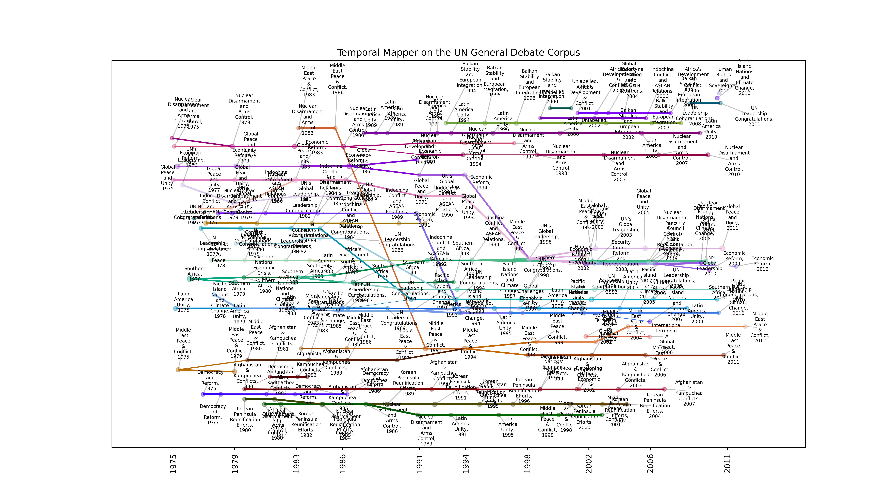

## Temporal Mapper

### V.1.2.1 - March 03 2026
-----------------------------------------------
This is a library for using the Mapper for temporal topic modelling. 
The primary components are:
* A scikit-learn compliant Mapper class `temporalmapper.Mapper` implementing density-based Mapper.
* A much messier wrapper class `temporalmapper.TemporalMapper` that computes additional data useful for temporal topic modelling.
* Interactive and static plotting functions such as `TemporalMapper.temporal_plot`.

Direct questions to Kaleb D. Ruscitti: kaleb.ruscitti at uwaterloo.ca .

Complete documentation is under construction on [Read The Docs](
https://temporal-mapper.readthedocs.io/en/latest/).

### Example:
#### United Nations General Debate Corpus
The [United Nations General Debate Corpus](https://journals.sagepub.com/doi/epub/10.1177/2053168017712821) 
contains transcripts of the United Nations General Debates from 1970-2014. We can chunk and embed these transcripts
using `SBERT` and produce a topic model of the dataset using [Toponymy](https://github.com/tutteinstitute/toponymy).

Then using this repository, we can model the changes in the topics over time, producing a graph whose nodes are topics at a given time:

 

### Installation
Install from PyPI:
`pip install temporal-mapper`

Or, clone the repo and install: 

`git clone https://github.com/TutteInstitute/temporal-mapper.git`

`cd temporal-mapper && pip install .`

### Development Instructions
#### Getting set up
(Mostly for my future self...)

Clone the repo:
`git clone https://github.com/TutteInstitute/temporal-mapper.git`

Then make a virtual environment and install the package and pytest.

`cd temporal-mapper && python -m venv .venv`

`source .venv/bin/activate`

`pip install -r requirements.txt && pip install -e .`

Before making any changes, check that the tests run successfully:

`cd tests && python -m pytest mapper.py`
