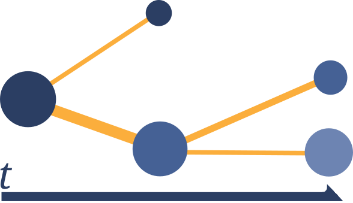
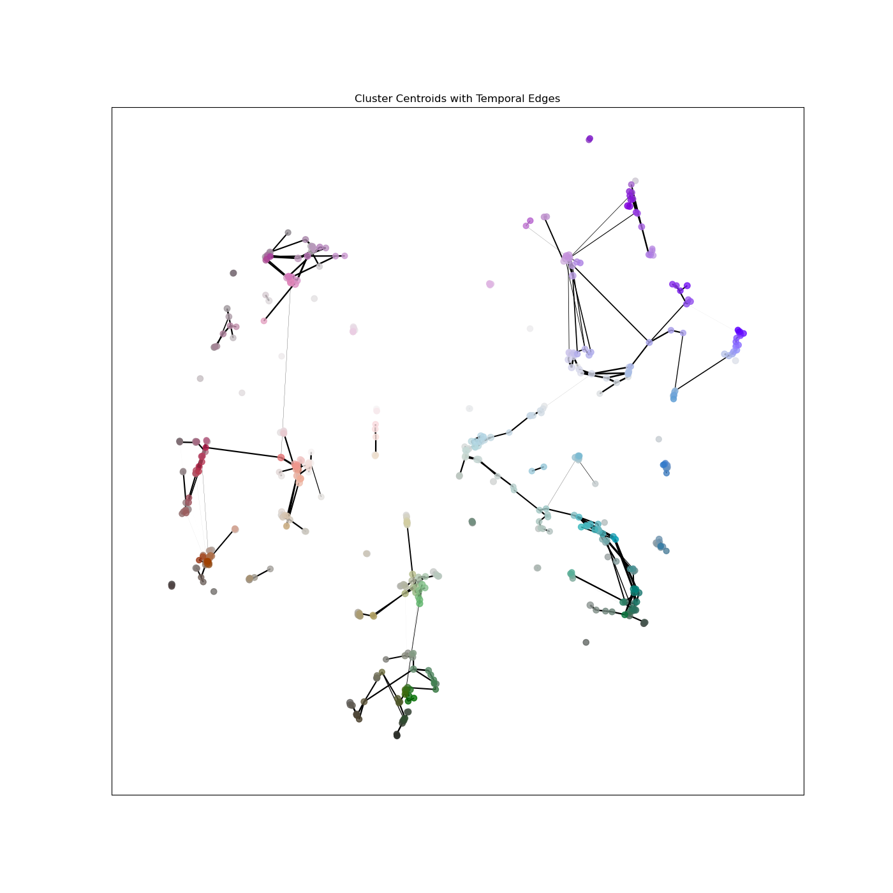

## Temporal Mapper

### V.1.0.0 - October 06 '24
-----------------------------------------------
This is a library for using the Mapper for temporal topic modelling.
Though things broadly work now, the edge cases have not been throughly 
tested.

Direct questions to Kaleb D. Ruscitti: kaleb.ruscitti at uwaterloo.ca .

Complete documentation is under construction on [Read The Docs](
https://temporal-mapper.readthedocs.io/en/latest/).

### Example:
#### arXiv Papers 
From the arXiv API, we can retrieve ~500,000 article titles and abstracts,
use `SBERT` to embed them, and then UMAP to reduce to 2D.

Using [DataMapPlot](https://github.com/tutteinstitute/datamapplot) and
[TopicNaming](https://github.com/tutteinstitute/topicnaming) we can
produce a static plot of this data:

Now, using this repository we can additionally analyse the temporal
information. Using the Mapper algorithm with time as our lens
function, we create a *temporal graph* of the topics (clusters)
through time. The code includes two types of plots to visualize this
graph:

Centroid Plot             |  Temporal-Semantic Plot
:-------------------------:|:-------------------------:
  |  

### Installation
Install from PyPI:
`pip install temporal-mapper`

Or, clone the repo and install: 
`git clone https://github.com/TutteInstitute/temporal-mapper.git`
`cd temporal-mapper && pip install .`
