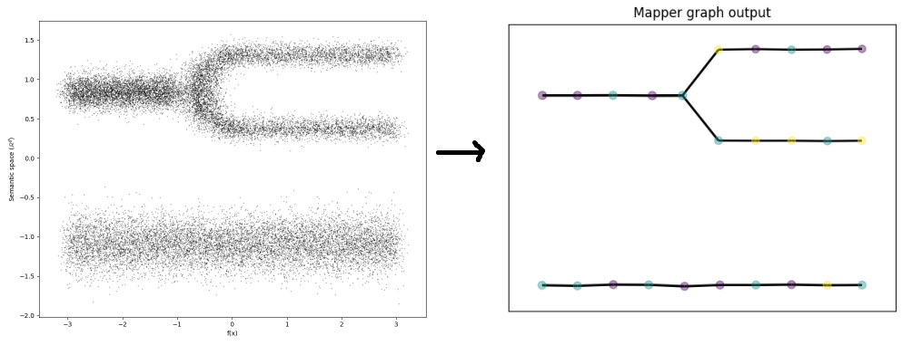

Welcome to Temporal Mapper's documentation!
===========================================

Temporal Mapper is a library for performing *temporal topic modeling*
which is built using the Density-Based Mapper algorithm.

.. toctree::
    :maxdepth: 2
    :caption: Usage:

    installation
    quickstart
    dbmapper_theory
    paramselection

.. toctree::
    :maxdepth: 2
    :caption: Visualizations:

    temporal-plot
    centroid-datamap
    growth-map

.. toctree::
    :maxdepth: 1
    :caption: Examples:

    toponymy-integration

.. toctree::
    :maxdepth: 2
    :caption: Module Reference:

    api

Indices and tables
==================

* :ref:`genindex`
* :ref:`modindex`
* :ref:`search`
